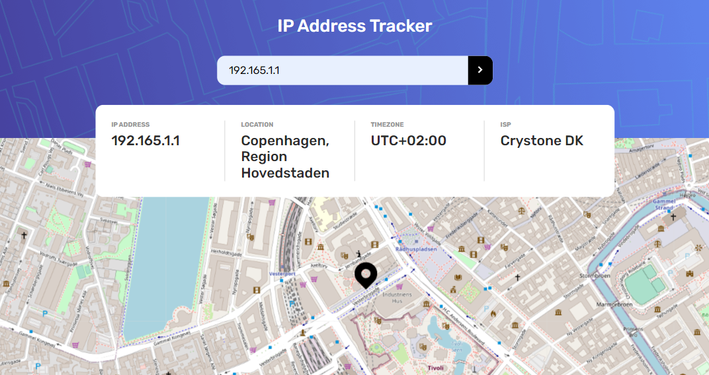

# Frontend Mentor - IP address tracker solution

This is a solution to the [IP address tracker challenge on Frontend Mentor](https://www.frontendmentor.io/challenges/ip-address-tracker-I8-0yYAH0). Frontend Mentor challenges help you improve your coding skills by building realistic projects. 

## Table of contents

- [Frontend Mentor - IP address tracker solution](#frontend-mentor---ip-address-tracker-solution)
  - [Table of contents](#table-of-contents)
  - [Overview](#overview)
    - [The challenge](#the-challenge)
    - [Screenshot](#screenshot)
    - [Links](#links)
  - [My process](#my-process)
    - [Built with](#built-with)
    - [What I learned](#what-i-learned)
    - [Continued development](#continued-development)
    - [Useful resources](#useful-resources)
  - [Author](#author)

## Overview

### The challenge

Users should be able to:

- View the optimal layout for each page depending on their device's screen size
- See hover states for all interactive elements on the page
- See their own IP address on the map on the initial page load
- Search for any IP addresses or domains and see the key information and location

### Screenshot



### Links

- Solution URL: [GitHub](https://github.com/lemartinezm/ip-address-tracker)
- Live Site URL: [Vercel](https://ip-address-tracker-virid.vercel.app/)

## My process

### Built with

- Semantic HTML5 markup
- CSS custom properties
- Flexbox
- Grid
- SASS/SCSS
- Mobile-first workflow
- [React](https://reactjs.org/) - JS library
- [react-leaflet](https://react-leaflet.js.org/) - React components for Leaflet maps

### What I learned

- Create maps with react-leaflet

```js
<MapContainer center={[51.15, -9.06]} zoom={15} scrollWheelZoom={false}>
  <TileLayer
    attribution='&copy; <a href="https://www.openstreetmap.org/copyright">OpenStreetMap</a> contributors'
    url="https://{s}.tile.openstreetmap.org/{z}/{x}/{y}.png"
  />
  <Marker position={[51.15, -9.06]} />
</MapContainer>
```

### Continued development

- react-leaflet

### Useful resources

- [react-leaflet](https://react-leaflet.js.org/) - This helped me for creating maps.

## Author

- Frontend Mentor - [@lemartinezm](https://www.frontendmentor.io/profile/lemartinezm)
- LinkedIn - [lemartinezm](https://www.linkedin.com/in/lemartinezm)
- Twitter - [@Luis14151617](https://twitter.com/Luis14151617)
